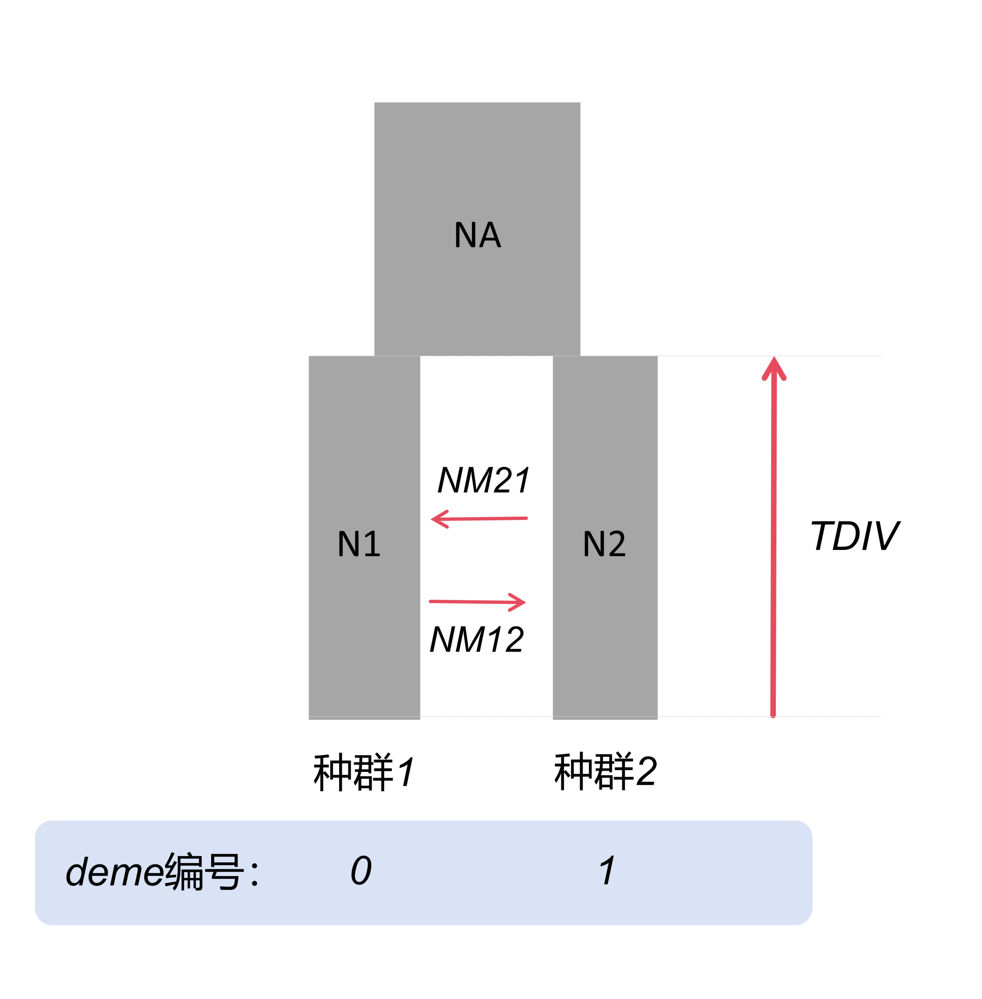

# fastsimcoal v2.8 教程

## 目录

- [一、软件安装](#一软件安装)
- [二、输入文件准备](#二输入文件准备)
  - [1. 频谱文件（SFS - Site Frequency Spectrum）](#1-频谱文件sfs---site-frequency-spectrum)
  - [2. tpl文件（Template file）](#2-tpl文件template-file)
  - [3. est文件（Estimation file）](#3-est文件estimation-file)
- [三、运行fastsimcoal](#三运行fastsimcoal)
  - [1. 基本命令](#1-基本命令)
  - [2. 输出文件](#2-输出文件)
- [四、参考资料](#四参考资料)

>**写在前面：** fastsimcoal28 (简写为fsc28) 是一种基于**溯祖模拟（coalescent simulation）**的软件，可以用来模拟多种复杂进化场景下的分化时间、有效种群大小、基因流模式等。
>它的核心思想可以概括为：通过溯祖模拟产生大量理论SFS，再与观测频谱（真实数据得>到的）进行比较，用最大似然寻找最符合数据的进化模型。


## 一、软件安装

### 1. 下载
访问官方网站：http://cmpg.unibe.ch/software/fastsimcoal2/

下载适用于Linux系统的压缩包（通常为zip格式）。

### 2. 安装
将下载的压缩包解压，例如：
```bash
unzip fsc28_linux64.zip
```

### 3. 测试安装
进入解压后的目录（ `cd fsc28_linux64` ），为可执行文件添加执行权限：
```bash
chmod +x fsc28
```

运行程序查看帮助信息，确认安装成功：
```bash
./fsc28
```

如果显示帮助信息，则安装成功。

### 4. 配置环境变量
为了在任意目录下都能直接调用fsc28，可以将程序路径添加到系统PATH中：

编辑bashrc文件：
```bash
vim ~/.bashrc
```

在文件末尾添加：
```bash
export PATH=/path/to/fsc28_directory/:$PATH
```
（将/path/to/fsc28_directory/替换为实际的fsc28目录路径）

保存并退出后，使配置生效：
```bash
source ~/.bashrc
```

现在就可以在任意目录下直接使用`fsc28`命令了。


## 二、输入文件准备

### 1. 频谱文件（SFS - Site Frequency Spectrum）
频谱包括：
- **折叠频谱（MAF - Minor Allele Frequency）**：不考虑祖先等位基因状态
- **非折叠频谱（DAF - Derived Allele Frequency）**：需要祖先状态信息

#### 生成SFS的方法：
生成SFS有多种方法，其中最简单的一种是使用easySFS，这是一个基于Python的工具，构建在dadi库之上。easySFS可以自动处理缺失数据，通过投影（downsampling）种群大小来最大化可用位点数量。

##### 使用easySFS生成SFS的步骤：

1. **创建工作目录并准备数据**
   ```bash
   mkdir SFS
   cd SFS
   # 声明VCF变量
   VCF="/path/to/snp.vcf.gz"
   ```


2. **创建种群文件**
   使用bcftools从VCF文件中提取样本信息，并根据样本名创建种群文件：
   ```bash
   bcftools query -l $VCF | awk '{split($0,a,"."); print $1,a[2]}' > pop_file
   ```
   pop_file格式示例：
   ```
   sample1 pop1
   sample2 pop1
   sample3 pop2
   ```

4. **估计最佳投影值**
   easySFS可以预览不同投影值下的可用位点数量，帮助选择最佳的downsampling策略：
   ```bash
   easySFS.py -i $VCF -p pop_file -a -f --preview > projection_preview.txt
   ```
   查看输出文件，选择能保留最多位点的投影值。

5. **生成SFS**
   使用确定的投影值运行easySFS：
   ```bash
   easySFS.py -i $VCF -p pop_file -a -f --proj proj1,proj2,proj3
   ```
   其中proj1,proj2,proj3是各种群的投影样本数。投影值的顺序对应于pop_file中种群的顺序，通常按照种群名称的字母顺序排列。例如，如果pop_file包含种群Apop、Bpop、Cpop，则--proj 4,10,2表示Apop投影到4个样本，Bpop到10个，Cpop到2个。同时，--preview的输出projection_preview.txt，它会显示种群的顺序和推荐的投影值，这样可以确保顺序正确。

   参数说明：
   - `-i`: 输入VCF文件
   - `-p`: 种群文件
   - `-a`: 生成折叠SFS
   - `-f`: 强制覆盖输出
   - `--proj`: 指定各群体的投影样本数
   - `--preview`: 预览模式，估计投影值


其他生成SFS的方法：
- 使用`dadi`或`moments`计算
- 使用ANGSD（适用于低覆盖度和包含许多缺失的数据）
- 手动从VCF文件计算


### 2. tpl文件（Template file）
定义历史事件和参数的文件，参数使用keywords代替。

两个种群分化，分化后存在持续基因流：

**说明**：TDIV世代前，种群1和种群2合并到一起，成为祖先群体。两个种群自分化后存在不对称的基因流，从种群1迁移到种群2的个体数为NM12，从种群2迁移到种群1的个体数为NM21。
*注：deme编号为SFS文件中种群的顺序，即按首字母排序，第一个种群为deme0。*

tpl文件内容：
```
//Parameters for the coalescence simulation program : fsimcoal2.exe
2 samples to simulate :
//Population effective sizes
N1
N2
//Samples sizes and samples age 
5
5
//Growth rates: negative growth implies population expansion
0
0
//Number of migration matrices: 0 implies no migration between demes
2
//Migration matrix 0
0 MIG1
MIG2 0
//Migration matrix 1
0 0
0 0
//Historical events：time, source, sink, migrants, new deme size, new growth rate, migration matrix index
1 historical event
TDIV 0 1 1 RESIZE 0 1
//Number of independent loci [chromosome] 
1 0
//Per chromosome: Number of contiguous linkage Block: a block is a set of contiguous loci
1
//per Block:data type, number of loci, per generation recombination and mutation rates and optional parameters
FREQ  1   0  1.48e-8 OUTEXP
```

#### tpl文件各部分说明

1. **样本个数（samples to simulate）**  
   指定共有多少个群体/种群需要模拟。本例为2个。

<br>

2. **Population effective sizes**  
   每个种群的有效种群大小。  
   **⚠️ 注意**：这里的单位是“基因拷贝数”。对于二倍体（diploid）种群，通常为“个体数×2”。在tpl中写入的是参数名（如N1、N2），在est文件中设置其范围。因此，对于二倍体样本，软件模拟出N1、N2参数的值后，记得除以2才是我们通常所说的有效种群大小Ne。

<br>

3. **Samples sizes and samples age**  
   每个种群在SFS中使用的样本数量（通常等于采样个体数）以及样本采样时间（一般为0，表示现代样本）。

<br>

4. **Growth rates**  
   每个种群的指数增长率。fastsimcoal中使用指数增长模型：  
   \[ N(t) = N_0 \times e^{r \times t} \]  
   其中：  
   - `t` 为时间（世代数），从现在向过去计算；  
   - `N_0` 为当前种群大小（tpl中对应的N_e）；  
   - `r` 为增长率(growth rate)。  
   - `N_t` 为t世代之前的种群大小。  
   **解释**：由于时间是向过去的，`r<0` 表示向过去缩小，即正向时间（向前代数）表示种群扩张；`r>0` 表示向过去变大，正向时间（向前）表示种群收缩；`r=0` 表示种群大小恒定不变，没有扩张收缩。

<br>

5. **Number of migration matrices**  
   迁移矩阵的个数；0表示没有迁移；本例中2表示存在两个迁移矩阵。

<br>

6. **Migration matrix**  
   迁移率矩阵。
   本例中使用变量名 `MIG1` `MIG2`表示迁移率参数。矩阵通常以0填充对角线（自身不迁移）。例如：  
   ```text
   0 MIG1
   MIG2 0
   ```  
   代表的意思是：  
    |  | 种群1 | 种群2 |
    |---|---|---|
    | 种群1 | 0 | MIG1 |
    | 种群2 | MIG2 | 0 |  

   **⚠️ 重要**：在向后追溯时间时，种群1以MIG1的速率向种群2发送迁移者，而种群2以MIG2的速率向种群1发送迁移者。因此，每个迁移矩阵中的非对角元素 {𝑚𝑖𝑗} 表示：对于任意给定的一条谱系，其在向后追溯时间时从 deme i 移动到 deme 𝑗 的概率。对角线元素会被忽略。  意味着，正向时间时，种群2向种群1的迁移率为MIG1，而种群1向种群2的迁移率为MIG2 ！！！
   **计算迁移个体数**：`迁移率=迁移个体数/接收方（正向时间）的种群大小` 迁移率MIG1即正向时间种群2向种群1，因此分母为种群1的有效种群大小，也就是`MIG1=NM21/N1`,而`MIG2=NM12/N2`。  
   **提示**：正反方向容易混淆，大家可以选择仅记住一种方向，比如我们仅仅按照正向时间思考：  
   |  | 种群1 | 种群2 |
   |---|---|---|
   | 种群1 | 0 | MIG1 |
   | 种群2 | MIG2 | 0 | 

   那么该表格第一行表示源（source），第一列表示汇（sink）。种群2向种群1的迁移率（MIG1）=种群2向种群1的迁移个体数（NM21）/种群1的有效种群大小（N1）。

<br>

7. **Historical events**  
   历史事件的数量以及每个事件的详细描述。每个事件行由7个数字或参数组成：  
   (1) 距今 t 世代之前发生该历史事件的时间。  
   (2) 源 deme（source deme） 的编号。  
   (3) 汇入 deme（sink deme） 的编号。  
   (4) 从源 deme 移动到汇入 deme 的迁移者预期比例。注意，这个比例并不是固定的，它同时也表示：源 deme 中每一条谱系迁移到汇入 deme 的概率。  
   (5) 汇入 deme 的新大小，相对于该 deme 在 t 代时的大小。  
   (6) 汇入 deme 的新增长率。  
   (7) 新迁移矩阵编号，从t世代再往早时候追溯将使用该迁移矩阵，默认情况下，从当前到t世代使用迁移矩阵0。  
   **示例**：在下面的例子中，定义了 2 个历史事件:  
   ```
    //historical event: time, source, sink, migrants, new size, growth rate, migr. matrix 
    2 historical event 
    1000 0 0 0 1 0 1 
    10000 1 0 1 10 0 1
   ```  
   - 第一个事件发生在 1000 代之前，它的作用只是把当前使用的迁移矩阵设为 矩阵 1；在此之前一直使用的是 矩阵 0。  
   - 第二个事件发生在 10000 代之前，其含义是：deme 1 中的所有谱系（即比例为 1）都会迁移到 deme 0。与此同时，deme 1 的大小增加为原来的 10 倍，并且在更早的时间中仍然继续使用 迁移矩阵 1。(换一种说法，祖先种群在10000代分化成两个种群，并且祖先种群大小为其中一个子种群的10倍。)  
   **提示**：对于new size这个参数，可以使用绝对数值，而不是乘数因子表示，在该行后面加上`absoluteResize`关键词即可，那么这个绝对数值就是代表祖先种群大小。  
   **本例说明**：`TDIV 0 1 1 RESIZE 0 1` 表示在TDIV世代时，**deme0全部迁移到deme1**，deme1的大小增加为原来的RESIZE倍，并且在更早的时间中使用 迁移矩阵 1。

<br>

8. **Number of independent loci [chromosome]**  
   指定独立染色体或独立片段的数量。

<br>

9. **Per chromosome: Number of contiguous linkage Block**  
   每个染色体上的连续位点块数（block）。

<br>

10. **Block信息行**  
    指定该block的数据类型（`FREQ`表示SFS），位点数、每代重组率、每代突变率，以及可选参数（`OUTEXP`表示输出expected site frequency spectrum）。

<br>

**更详细的解释请查阅fsc官方手册。**

<br>


### 3. est文件（Estimation file）
定义参数的搜索范围和先验分布。

示例est文件：
```
// Priors and rules file
// *********************

[PARAMETERS]
//#isInt? #name #dist.#min #max
//all N are in number of haploid individuals
1 ANCSIZE unif 100 100000 output
1 N1 unif 100 100000 output
1 N2 unif 100 100000 output
0 NM21 logunif 1e-2 20 hide
0 NM12 logunif 1e-2 20 hide
1 TDIV unif 100 20000 output

[COMPLEX PARAMETERS]
0 RESIZE = ANCSIZE/N2 hide
0 MIG1 = NM21/N1 output
0 MIG2 = NM12/NPOP2 output
```

#### est文件说明

1. **参数范围设置**：参数的搜索范围基于先验知识确定。在软件模拟过程中，这些值定义了搜索空间：下限是绝对最小值，而上限在搜索时可能被超出。若要防止超出上限，可以使用 `bounded` 关键词。

2. **参数类型**：参数可以是整数或浮点数，用 0（浮点数）或 1（整数）表示。

3. **分布类型**：参数可以遵循均匀分布（uniformly）或对数均匀分布（log-uniformly）。

4. **输出控制**：`output` 表示在结果中显示该参数，`hide` 表示隐藏。

## 三、运行fastsimcoal

### 1. 基本命令
```bash
fsc28 -t template.tpl -e estimation.est -m -0 -C 10 -n 100000 -L 40 -s0 -multiSFS -M -q -c 12
```

参数说明：
- `-t`: tpl文件
- `-e`: est文件
- `-m`: 折叠频谱MAF
- `-0`: 忽略单态位点
- `-C 10`: 忽略SNP少于10个的SFS条目
- `-n`: 溯祖模拟次数，理想情况下应在200000-1000000
- `-L`: 最大似然搜索的循环次数（ECM cycles），50-100次之间最佳
- `-s0`: 输出SNP
- `-multiSFS `: 当使用超过两个种群的SFS文件时，使用该参数
- `-M`: 必要参数，表示执行最大似然估计
- `-q`: 安静模式
- `-c`: 线程数


为了获得可靠的参数估计，通常需要运行多个独立的模拟，例如50-100次：

```bash
#!/bin/bash

# fsc28可执行文件路径
fsc28="/path/to/fsc28"

# 模型前缀
PREFIX="model_name"

# 运行50个独立模拟
for i in {1..50}
do
   mkdir run$i
   cp ${PREFIX}.tpl ${PREFIX}.est ${PREFIX}_MSFS.obs run$i"/"
   cd run$i
   $fsc28 -t ${PREFIX}.tpl -e ${PREFIX}.est -m -0 -C 10 -n 100000 -L 40 -s0 -multiSFS -M -q -c 12
   cd ..
done
```


运行多个模拟后，需要选择**似然值最高**的。参考脚本 [fsc-selectbestrun.sh](./scripts/fsc-selectbestrun.sh)，将会计算最佳运行并把它复制到一个新文件夹`bestrun`。

运行：
```bash
sh fsc-selectbestrun.sh
```


我们使用fsc28模拟了多个模型，然后完成上述操作后，使用AIC值选择最佳模型。参考脚本[calculateAIC.sh](./scripts/calculateAIC.sh)


运行：
```bash
cd /path/to/bestrun
chmod +x calculateAIC.sh
./calculateAIC.sh {PREFIX}

```

选择出最佳模型后，再次进行多次独立运行，选择其中似然值最高的一次作为最终结果。多次运行的结果可作为bootstrap重复。

### 2. 输出文件
模拟的结果在`{PREFIX}.bestlhoods`文件中。
此外，还有多个输出，具体解释请阅读官方手册。


## 四、参考资料

- [fastsimcoal官方手册](https://cmpg.unibe.ch/software/fastsimcoal2/man/fastsimcoal28.pdf)
- [Speciation & Population Genomics: a how-to-guide](https://speciationgenomics.github.io/fastsimcoal2/)